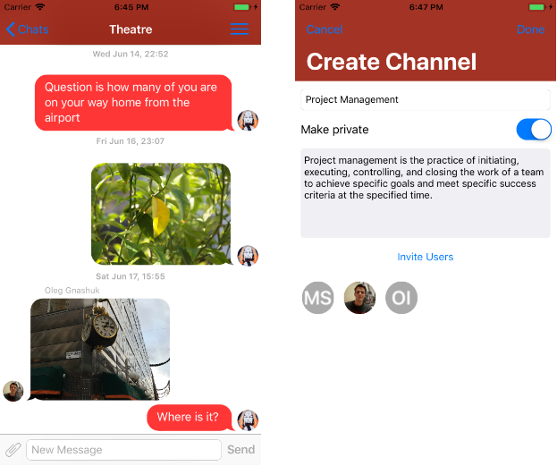
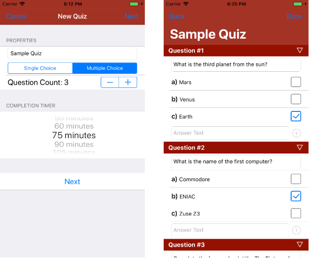

# Gannimede
*An iOS chat app designed for team collaboration and aimed at communication between students and teachers*

<p align="center">
  
</p>

<hr>

<p align="center">
  
</p>

Compatibility
-------------
Requires iOS 11.0 or above

Installation
-----------
### Prerequisites
 - XCode 9
 - CocoaPods
 
### Installation Steps
 1. Generate XCode workspace through CocoaPods:
 ```shell
pod install
```
 2. Open `Gannimede.xcworkspace`
 
### Privacy Policy
https://gannimede.flycricket.io/privacy.html
